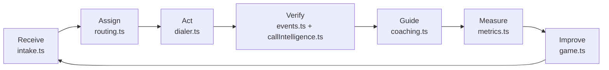
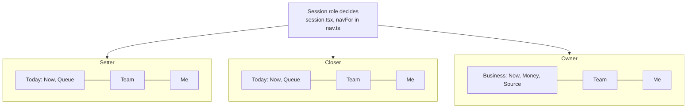
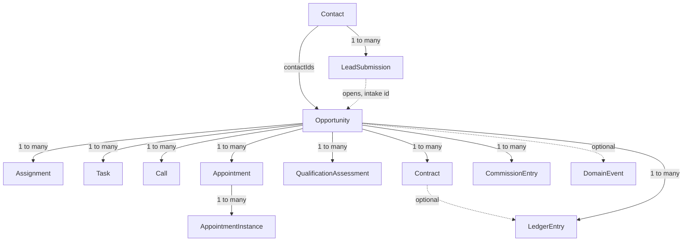
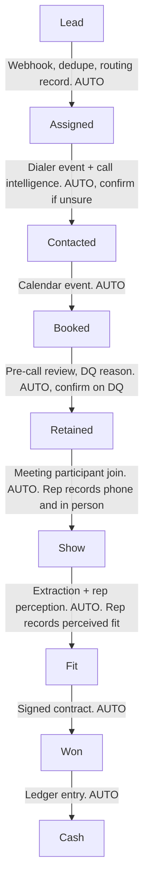
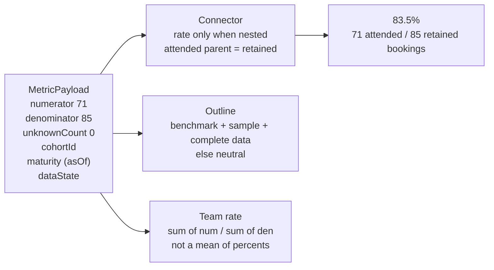
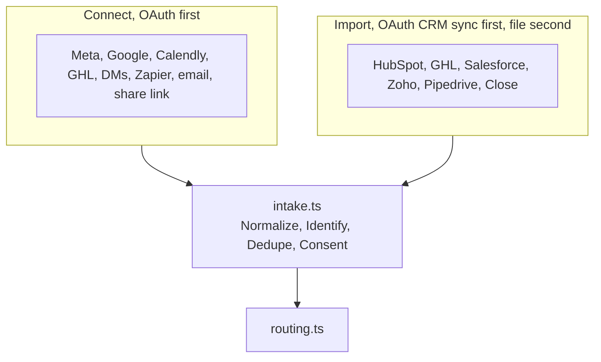
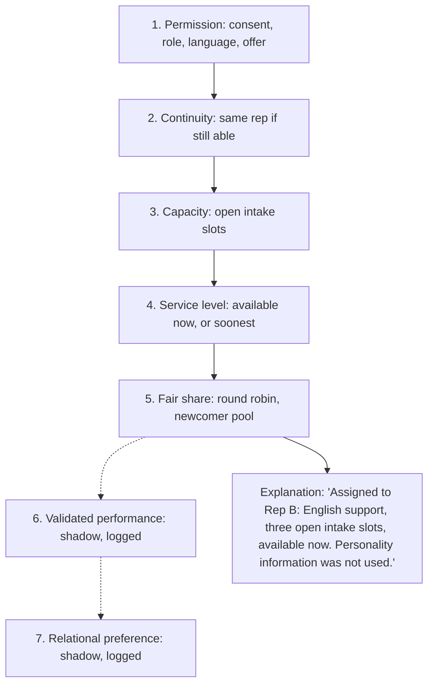
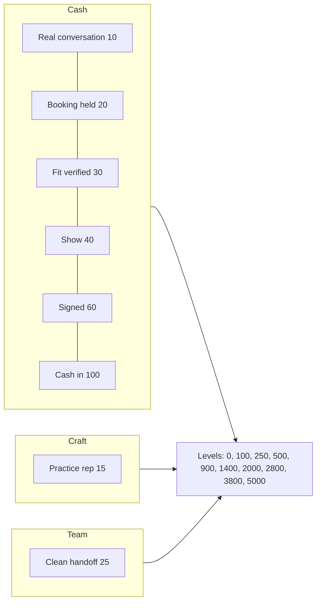
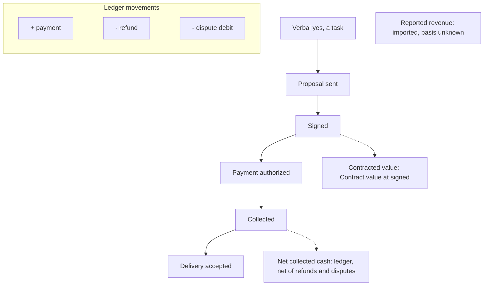
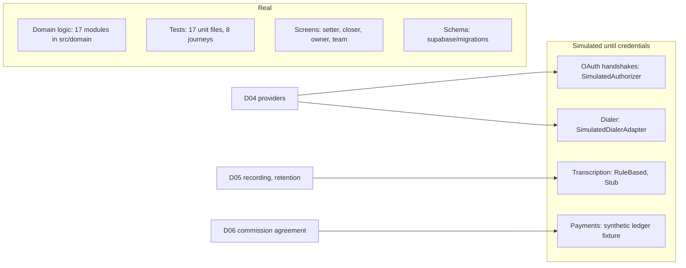

# Sales OS system map

Ten pictures. Every box names the code that owns it. One rule under all of them: nothing moves without evidence.

Companion page: the same ten sections as a phone-first HTML artifact (published by the coordinator).

## 1. The one loop

The same opportunity goes around once. Source to cash. One module owns each step.

Modules: [`src/domain/intake.ts`](../src/domain/intake.ts), [`src/domain/routing.ts`](../src/domain/routing.ts), [`src/domain/dialer.ts`](../src/domain/dialer.ts), [`src/domain/events.ts`](../src/domain/events.ts), [`src/domain/callIntelligence.ts`](../src/domain/callIntelligence.ts), [`src/domain/coaching.ts`](../src/domain/coaching.ts), [`src/domain/metrics.ts`](../src/domain/metrics.ts), [`src/domain/game.ts`](../src/domain/game.ts).

## 2. Who sees what

You sign in as who you are. That decides the whole world. Three tabs per role, no role switcher. No lane crosses.

- Reps get Today, Team, Me. The owner gets Business, Team, Me. Exactly three, from [`src/components/shell/nav.ts`](../src/components/shell/nav.ts).
- The role comes from the stored session in [`src/lib/session.tsx`](../src/lib/session.tsx).
- Connect and Import are owner only. A rep who lands there is sent home ([`ConnectScreen.tsx`](../src/components/connect/ConnectScreen.tsx), [`ImportScreen.tsx`](../src/components/import/ImportScreen.tsx)).

## 3. The entity chain

A person is not a lead. A lead is not a deal. A deal is not a payment. Opportunity is the hub; everything under it carries its id.

- `tenant_id` on every box.
- Money is integer cents with a currency. Unknown is a valid value.
- A duplicate submission is recorded but never opens a second opportunity.
- Every change is appended to `DomainEvent` with an idempotency key and evidence refs.

Source: [`src/domain/types.ts`](../src/domain/types.ts), [`src/domain/events.ts`](../src/domain/events.ts).

## 4. How a stage moves

Each hop names its proof. The rep confirms only when the proof is unsure.

AI never writes: **Money**, **Consent**, **Attendance**. The model proposes. A policy function moves the stage. Providers and the ledger own the facts that matter most.

Source: [`docs/PRD.md`](./PRD.md) section 10, [`src/domain/callIntelligence.ts`](../src/domain/callIntelligence.ts) (`FORBIDDEN_AI_EVENT_TYPE`), [`src/domain/dialer.ts`](../src/domain/dialer.ts).

## 5. Where the numbers come from

No metric is a bare number. Every one carries its parts.

- Zero denominator shows N/A, never 0%. Unknown stays unknown.
- A connector renders only when the numerator stage's parent is the denominator stage (`computeFunnel`).
- Outline needs a benchmark, a sample at or above `minDenominator`, and a `complete` data state; otherwise neutral or a data-state treatment (`evaluate`).
- Team rate is pooled numerator over pooled denominator (`computeTeamRate`).

Source: [`src/domain/metrics.ts`](../src/domain/metrics.ts), [`src/domain/performance.ts`](../src/domain/performance.ts), [`src/domain/types.ts`](../src/domain/types.ts) (`MetricPayload`, `FunnelStage`).

## 6. How leads arrive

Two doors. One hallway. Every lead walks the same four steps.

- Identity is phone first, then email, never name alone. Consent is never assumed.
- Files, keys and webhooks exist only for tools with no OAuth, and sit below it.
- A replayed provider event changes nothing.

Source: [`src/domain/intake.ts`](../src/domain/intake.ts) (`ingest`), [`src/domain/integrations.ts`](../src/domain/integrations.ts), [`src/domain/crmSync.ts`](../src/domain/crmSync.ts), [`src/domain/migration.ts`](../src/domain/migration.ts).

## 7. How a lead is assigned

A ladder. Each rung narrows the field. The last two only watch.

Steps 1 to 5 decide. Steps 6 and 7 are computed into `Assignment.shadow`, never applied. A manager can read the result in `Assignment.explanation`.

Source: [`src/domain/routing.ts`](../src/domain/routing.ts) (`route`).

## 8. What earns XP

Verified events only. Never clicks, dials or notes. Three tracks: Cash, Craft, Team.

- Season: monthly reset of the display. History stays.
- Quality gate: a refund, dispute or opt-out pauses the mechanic for that rep.
- Mission: carries a proof rule, not a checkbox. One active.
- XP never converts to pay.

Source: [`src/domain/game.ts`](../src/domain/game.ts) (`XP_TABLE`, `LEVELS`, `qualityGate`), [`src/domain/gamification.ts`](../src/domain/gamification.ts) (`seasonFor`, `missionFromRecommendation`).

## 9. What the money is

A verbal yes is a task. A signature is not cash. Cash is not profit.

- Three bases, always labeled: reported revenue, contracted value, net collected cash.
- Refunds and disputes are ledger entries, never edits.
- Commission per attended appointment is not an hourly rate.
- Scenarios are not forecasts. Benchmark gaps are not lost money.
- The commission policy is a labeled hypothesis until D06.

Source: [`src/lib/workspace-closer.ts`](../src/lib/workspace-closer.ts) (`LADDER_STEPS`), [`src/domain/types.ts`](../src/domain/types.ts) (`RevenueBasis`, `LedgerEntryKind`), [`src/domain/events.ts`](../src/domain/events.ts) (`netCollectedFromLedger`), [`src/domain/metrics.ts`](../src/domain/metrics.ts) (M18).

## 10. What is real today and what is simulated

The logic is built. The wires to the outside world wait on three decisions.

- Same interfaces, swapped adapters. The app runs with zero outside credentials; an in-memory fixture is the default.
- Nothing in `supabase/` is applied without explicit sign-off.

Source: [`docs/spec/28_TRACEABILITY_AND_OPEN_DECISIONS.md`](./spec/28_TRACEABILITY_AND_OPEN_DECISIONS.md) (D04, D05, D06), [`docs/ROADMAP.md`](./ROADMAP.md) phase 7, [`src/domain/integrations.ts`](../src/domain/integrations.ts), [`src/domain/dialer.ts`](../src/domain/dialer.ts), [`src/domain/callIntelligence.ts`](../src/domain/callIntelligence.ts), [`src/domain/crmSync.ts`](../src/domain/crmSync.ts).
